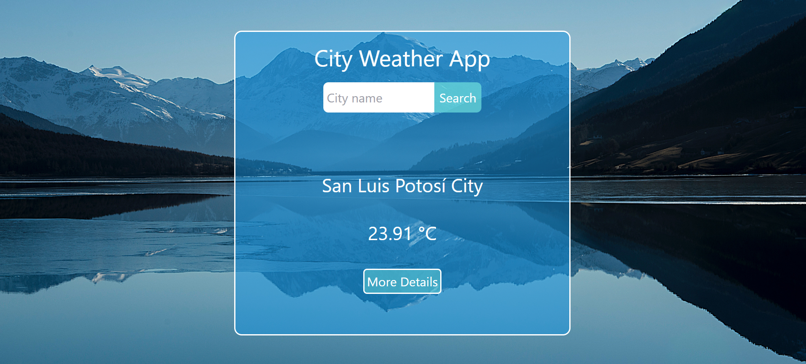
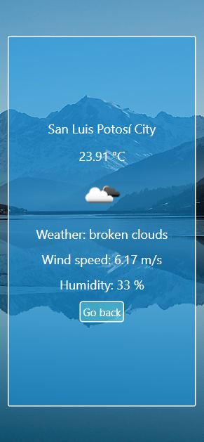

# Weather App

Check the weather of a city with the OpenWeatherMap API.

Includes:

1.  Main page with the city and its weather.
2.  View with more weather details.

# Deployment

VERCEL: 

[LINK](https://apiweather-app.vercel.app/)

## Screenshots

Desktop version:

Mobile version:

## Libraries

1.  [REACT](https://en.reactjs.org/)
2.  [REACT ROUTER](https://reactrouter.com/)
3.  [TAILWIND CSS](https://tailwindcss.com/docs/guides/create-react-app)

## Install and run project

1. Clone repo.
2. Install modules `npm install`.
3. Make an account and get an api key in [Open weather api](https://openweathermap.org/).
4. Check .env.example file and create a `.env` file. 
5. Setting up Tailwind CSS check [documentation link](https://tailwindcss.com/docs/guides/create-react-app).
6. Run project `npm start`.
